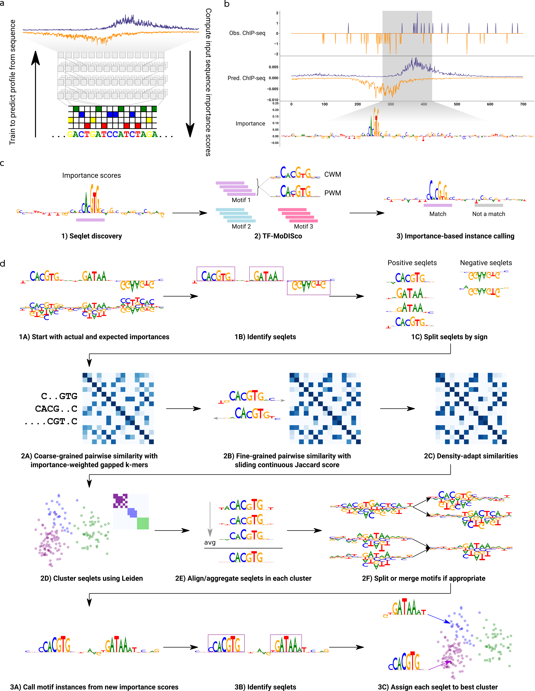

# *cis*-regulatory transcription-factor motif and syntax discovery from neural network models of *in vivo* ChIP binding



We present a computational framework for extracting transcription-factor (TF) motifs and their syntax/grammars using a neural network trained to predict TF binding from DNA sequence.

Below, we walk through the exact steps we took to run/call the various scripts/notebooks in this repository in order to produce the main results we present in our manuscript.

Needed dependencies are in the Makefile provided.

### Downloading training data
First, we download the data needed for training models. This consists of IDR peak files and aligned (and unfiltered) read BAMs (for the experiment and the input control).

We first downloaded metadata tables from ENCODE using the following commands:

- `encode_tf_chip_experiments.tsv`
	- A metadata file listing various experiments from ENCODE, filtered for those that are TF-ChIPseq experiments, aligned to hg38, and status released (and not retracted, for example)
	- Downloaded with the following command:
		```
		wget -O encode_tf_chip_experiments.tsv "https://www.encodeproject.org/report.tsv?type=Experiment&status=released&assay_slims=DNA+binding&assay_title=TF+ChIP-seq&assembly=GRCh38"
		```
- `encode_control_chip_experiments.tsv`
	- A metadata file listing various control experiments from ENCODE (i.e. for a particular cell-line, a ChIP-seq experiment with no immunoprecipitation), filtered for those that are aligned to hg38 and have a status of released
	- Downloaded with the following command:
		```
		wget -O encode_control_chip_experiments.tsv "https://www.encodeproject.org/report.tsv?type=Experiment&status=released&assay_slims=DNA+binding&assay_title=Control+ChIP-seq&assembly=GRCh38"
		```
- `encode_tf_chip_files.tsv`
	- A metadata file listing various ENCODE files, filtered for those that are aligned to hg38, status released, and of the relevant output types (i.e. unfiltered alignments, called peaks, and optimal IDR-filtered peaks)
	- Downloaded with the following commands:
		```
		FIRST=1; for otype in "unfiltered alignments" "peaks and background as input for IDR" "optimal IDR thresholded peaks"; do wget -O - "https://www.encodeproject.org/report.tsv?type=File&status=released&assembly=GRCh38&output_type=$otype" | awk -v first=$FIRST '(first == 1) || NR > 2' >> encode_tf_chip_files.tsv; FIRST=2; done
		```
- `encode_tf_chip_files_v2_with_signalbw.tsv`
	- A metadata file listing various ENCODE files, filtered for those that are aligned to hg38, status released, and of the relevant output types (i.e. unfiltered alignments, called peaks, optimal IDR-filtered peaks, and signal p-value)
	- Downloaded with the following commands:
		```
		FIRST=1; for otype in "signal p-value" "unfiltered alignments" "peaks and background as input for IDR" "optimal IDR thresholded peaks"; do wget -O - "https://www.encodeproject.org/report.tsv?type=File&status=released&assembly=GRCh38&output_type=$otype" | awk -v first=$FIRST '(first == 1) || NR > 2' >> encode_tf_chip_files.tsv; FIRST=2; done
		```

The API for the download of the experiment and files metadata is described [here](https://app.swaggerhub.com/apis-docs/encodeproject/api/basic_search/)

We downloaded our metadata files on 19 Oct 2019, and the exact versions we obtained can be found under [supporting_info](supporting_info/).

Starting with these tables, we used [download_ENCODE_data.py](src/data/download_ENCODE_data.py) to download the needed files for the following TFs: E2F6, FOXA2, SPI1, CEBPB, MAX, GABPA, MAFK, JUND, REST. This downloads all available hg38 experiments. This script is called as `python download_ENCODE_data.py -t {tf_name} -s {save_path}`.

For NR3C1, we used 11 experiments from the timeseries ENCSR210PYP.

For a full set of experiments used in this study, see [task_definitions.txt](supporting_info/task_definitions.txt).

We also obtained raw read data for ZNF248 binding [as measured by ChIP-exo](https://www.nature.com/articles/nature21683) from GSE78099, under SRR5197087.

For benchmarking with DiChIPMunk, we also obtained signal p-value BigWigs for each TF/experiment. To do so, we used [download_ENCODE_signal_bw.py](src/data/download_ENCODE_signal_bw.py) for each TF. For NR3C1, we did not obtain signal BigWigs, as they did not exist for every experiment.

### Processing training data

We then processed the downloaded data into a form that is amenable for training models. To do this, we ran [generate_ENCODE_profile_labels.sh](src/data/generate_ENCODE_profile_labels.sh) and then [create_ENCODE_profile_hdf5.py](src/data/create_ENCODE_profile_hdf5.py). Note that the former script requires bedTools, bedGraphToBigWig (from UCSC Tools), and the [hg38 chromosome sizes including chrEBV](https://github.com/ENCODE-DCC/encValData/blob/master/GRCh38/GRCh38_EBV.chrom.sizes).

These steps serve to filter the read BAMs, convert them to BigWigs, and then to HDF5 files which will be used for training.

For the NR3C1 time series, we downloaded preprocessed files that were processed by the ENCODE pipeline. These preprocessed files are available [here](http://mitra.stanford.edu/kundaje/leepc12/ENCSR210PYP/organized_output/), and the final processing was performed by [download_prep_NR3C1_reddy_time.sh](src/data/download_prep_NR3C1_reddy_time.sh).

The ZNF248 data was processed using the steps described in [ZNF248_chipexo_processing.pdf](supporting_info/ZNF248_chipexo_processing.pdf).

### Training the model

When we train a profile model, we use the following files:

- IDR peak file(s) for a TF
- Read HDF5 file for a TF
- Reference hg38 genome from UCSC
- Chromosome sizes of hg38

The fold definitions by chromosome can be found in [chrom_splits.json](supporting_info/chrom_splits.json).

Models can be trained multi-task (across all experiments of a single TF), or single-task (for a single experiment of a TF).

#### Hyperparameter search

For kind of model (multi-task or single-task), we perform hyperparameter search while training on fold 1. We ran 20 random seeds, each for only 5 epochs at most. This was done using the script [hyperparam.py](src/model/hyperparam.py) and the following commands (for each TF and task):
```
MODEL_DIR=output_path/multitask_model_result/ \
	python -m model.hyperparam \
	-f $filesspecpath \
	-c $configpath \
	-p counts_loss_learn_rate.json \
	-s chrom_splits.json \
	-k 1 \
	-n 20 \
	train.num_epochs=5

MODEL_DIR=output_path/singletask_model_result/ \
	python -m model.hyperparam \
	-f $filesspecpath \
	-c $configpath \
	-p counts_loss_learn_rate.json \
	-s chrom_splits.json \
	-k 1 \
	-n 20 \
	-i $taskindex \
	train.num_epochs=5
```

These commands require:
- [counts_loss_learn_rate.json](supporting_info/configs/counts_loss_learn_rate.json)
- File specs JSON, which can be found under `supporting_info/configs/{tf_name}/{tf_name}_paths.json`
- TF config JSON, which can be found under `supporting_info/configs/{tf_name}/{tf_name}_config.json`

The result of hyperparameter tuning found the best counts loss weight and learning rate for each single-task and multi-task model for each TF, and these results can be found under `supporting_info/configs/{tf_name}/{tf_name}_hypertune_task*.json`

#### Training with optimal hyperparameters

Now that we have the optimal hyperparameters, we train each multi-task and single-task model across all 10 folds of the genome. We run the following commands (for each TF and task):

```
MODEL_DIR=output_path/multitask_model_result/ \
	python -m model.hyperparam \
	-f $filesspecpath \
	-c $configpath \
	-s chrom_splits.json \
	-k $fold \
	-n 3 \
	train.num_epochs=15

MODEL_DIR=output_path/singletask_model_result/ \
	python -m model.hyperparam \
	-f $filesspecpath \
	-c $configpath \
	-s chrom_splits.json \
	-k $fold \
	-n 3 \
	-i $taskindex \
	train.num_epochs=15
```

Here, `configpath` now refers to `{tf_name}_hypertune_task*.json` from above, and `fold` ranges from 1 to 10.

The performance metrics from training all 10 folds can be found under `supporting_info/model_stats/*_allfolds_stats.tsv`.

#### Fine-tuning models

Finally, we take the best-performing fold for each multi-task and single-task model, and perform fine-tuning on all the output heads. Fine-tuning is performed via [finetune_tasks.py](src/model/finetune_tasks.py). We run the following commands (for each TF and task):

```
MODEL_DIR=output_path/multitask_model_result/ \
	python -m model.finetune_tasks \
	-f $filesspecpath \
	-s chrom_splits.json \
	-k $fold \
	-m $startingmodelpath \
	-t $numtasks \
	-n 3 \
	train.num_epochs=20 train.early_stop_hist_len=5

MODEL_DIR=output_path/singletask_model_result/ \
	python -m model.finetune_tasks \
	-f $filesspecpath \
	-s chrom_splits.json \
	-k $fold \
	-m $startingmodelpath \
	-t $numtasks \
	-n 3 \
	-i $taskindex -l \
	train.num_epochs=20 train.early_stop_hist_len=5
```

Here, `fold` is the best-performing fold for the model, `startingmodelpath` is the path to the model of the best validation loss (over all epochs) that fine-tuning starts with, and `numtasks` is the number of tasks for the TF.

The performance metrics from fine-tuning can be found under `supporting_info/model_stats/*_finetune_stats.tsv`.

For downstream analyses, unless stated otherwise, we use the fine-tuned models only, and we choose the best fine-tuned model based on validation loss between the single-task and multi-task architectures.

### Computing and saving model predictions/performance

For each model, we compute the model predictions and performance metrics across all peaks for that task.

To do this, we use the [predict_peaks.py](src/extract/predict_peaks.py) script. We run the following commands:

```
python -m extract.predict_peaks \
	-m $modelpath \
	-f $filesspecpath \
	-n $numtasks \
	-o output_path/multitask_predictions.h5

python -m extract.predict_peaks \
	-m $modelpath \
	-f $filesspecpath \
	-n $numtasks \
	-mn 1 \
	-i $taskindex \
	-o output_path/singletask_predictions.h5
```

Here, `modelpath` is the path to the model to run predictions on, and `numtasks` is the number of tasks for the TF.

For model, this generates a set of predictions for each peak and the performance metrics, and saves it as an HDF5.

For each TF, we can also compute a set of upper and lower bounds for the performance metrics. This is done using [bound_performance.py](src/extract/bound_performance.py) run on each TF's file specs JSON separately.

### Local interpretation with DeepSHAP

For each model, we can run DeepSHAP interpretation to obtain a set of importance scores over peaks for the prediction of binding. This is done using [make_shap_scores.py](src/tfmodisco/make_shap_scores.py). We run the following commands:

```
python -m tfmodisco.make_shap_scores \
	-m $modelpath \
	-f $filesspecpath \
	-dn $numtasks \
	-i $taskindex \
	-o output_path/multitask_imp_scores.h5

python -m tfmodisco.make_shap_scores \
	-m $modelpath \
	-f $filesspecpath \
	-dn $numtasks \
	-mn 1 \
	-i $taskindex \
	-o output_path/singletask_imp_scores.h5
```

Here, `modelpath` is the path to the model to run predictions on, and `numtasks` is the number of tasks for the TF. Note that even for multi-task models, we extract importance scores for a single task at a time (although the `-i` option may be omitted to extract importance scores for the aggregate of all tasks).

For each model (and each experiment/task in each multi-task model), this gives an HDF5 containing the importance scores over all peaks for the task, for both the profile-head and count-head predictions.

### Running TF-MoDISco for *de novo* motif discovery

Now that we have the DeepSHAP scores for each experiment, we can run TF-MoDISco to perform *de novo* motif discovery. For each set of importance scores, we run the following command:

```
python -m tfmodisco.run_tfmodisco \
	$impscorepath \
	-k $hypscorekey \
	-o output_path/tfmodisco_results.h5 \
	-s output_path/seqlets_file.fasta \
	-p output_path/plots
```

Here, `impscorepath` is the path to the DeepSHAP scores. `hypscorekey` is either `profile_hyp_scores` or `count_hyp_scores`, to run TF-MoDISco on the importance scores from the profile head or count head, respectively.

### Running the TF-MoDISco motif instance caller

To compute motif instance calls, we run the instance caller as follows:

```
python -m motif.tfmodisco_hit_scoring \
	output_path/imp_scores.h5 \
	output_path/tfmodisco_results.h5 \
	data_path/peaks.bed.gz \
	-k $hypscorekey \
	-o output_path/motif_instances
```

This script requires the DeepSHAP scores HDF5, and associated TF-MoDISco results HDF5, the key (either `profile_hyp_scores` or `count_hyp_scores`), and the set of peaks to call motifs instances in.

This gives a large BED file which contains the motif instances.

These motif instances are collapsed using the following commands:

```
python src/motif/collapse_motif_hits.py hits.bed 7 -d -3 > hits_collapsed-all.bed
python src/motif/collapse_motif_hits.py hits.bed 7 -s -d -3 > hits_collapsed-sep.bed
```

This collapsing merges together overlapping motif hits in two different ways: one by collapsing all hits across all motifs/patterns; and one by collapsing hits only within their own motif/pattern. Unless otherwise stated, downstream analyses use the "collapsed-all" treatment.

### Benchmark motifs

For each experiment for each TF, we also run HOMER, MEME, and DiChIPMunk on the (IDR) peak sets. To do so, we used [make_benchmarks.py](src/motif/make_benchmarks.py), and we ran the following commands:

```
python -m motif.make_benchmarks \
	-o output_path \
	-t peaks \
	-f $filesspecpath \
	-b homer,memechip \
	-i $taskindex

python -m motif.make_benchmarks \
	-o output_path \
	-t peaks \
	-f $filesspecpath \
	-b dichipmunk \
	-l 2000 \
	-i $taskindex \
	-s
```

For NR3C1, we did not include the -s flag for running DiChIPMunk.

These motifs were saved into an HDF5 file using [format_benchmark_motifs.py](supporting_info/format_benchmark_motifs.py)

### Benchmark motif instances

For each TF/experiment, we ran MOODS to obtain motif instances. For each TF/experiment, we took the motifs discovered by TF-MoDISco on the fine-tuned model which performed best, and ran MOODS using [run_moods.py](supporting_info/run_moods.py). We ran the following command:

```
python run_moods.py \
	$impscores \
	$tfmodisco_results \
	-p $peaksbedfile \
	-k $hypscorekey \
	-o output_path/moods_hits
```

These motif instances are collapsed using the following commands:

```
python src/motif/collapse_motif_hits.py hits.bed 5 > hits_collapsed-all.bed
python src/motif/collapse_motif_hits.py hits.bed 5 -s > hits_collapsed-sep.bed
```

### Avsec et. al. 2021 motif instances

We obtained ground-truth motif instances from Avsec et. al. 2021. From the authors, we obtained the following files:
- ChIP-seq peaks
- ChIP-nexus read BigWigs
- Importance scores from a model trained on ChIP-seq data
- Motif instance calls using the authors' methods

The importance scores were reformatted using [extract_BPNet_imp_scores.py](src/data/extract_BPNet_imp_scores.py).

We ran TF-MoDISco to perform motif discovery (on the profile-head importance scores) using the same command as above.

We ran the TF-MoDISco and MOODS instance callers on these importance scores as-is, using the following commands:

```
python run_moods.py \
	$tfname\_ChIPseq_imp_scores.h5 \
	$tfname\_tfmodisco_results_profile_head.h5 \
	-p $tfname\_peaks.bed \
	-k profile_hyp_scores \
	-il 1000 \
	-r mm10.fasta \
	-o out_path/$tfname\_moods_hits

python -m motif.tfmodisco_hit_scoring \
	$tfname\_ChIPseq_imp_scores.h5 \
	$tfname\_tfmodisco_results_profile_head.h5 \
	$tfname\_peaks.bed \
	-k profile_hyp_scores \
	-i 1000 \
	-m 0.3 \
	-p $tfname_patterninds
	-o out_path/$tfname\_tfmodisco_hits
```

The TF name is either Nanog, Oct4, or Sox2. The pattern indices used are `0,1,2,3,4,10`, `0,1,3,5,6`, and `0,1,2,3,5` respectively.

Collapsing is done as described above.

### Automated motif syntax/grammar analysis with summarized reports

We then run our automated pipeline for motif syntax/grammar analysis. This consists of a set of Jupyter notebooks which rely on some combination of the peak predictions, importance scores, and TF-MoDISco results (all as HDF5 files). Here, we describe each notebook, and the arguments/files it relies on. We generated our reports using the `jupyter nbconvert` command for each one.

All report notebooks can be found under `notebooks/reports/`.

#### `performance_comparison.ipynb`

This compares the performance of our models across all 10 folds, multi-task vs single-task, and fine-tuned vs non-fine-tuned.

Dependencies:
- Predictions/performance HDF5s for all multi-task and single-task models, across all 10 folds, and fine-tuned models (for a single TF)

This is run for a single TF at a time.

#### `view_tfmodisco_results.ipynb`

This visualizes the TF-MoDISco motifs, including:
- PFM, PWM, CWM, and hCWM of each discovered motif
- Average predicted/observed profile underlying motif seqlets
- Distance distribution of motif seqlets to peak summits
- TOMTOM matches of each motif
- Examples of seqlet importance scores for each motif

Dependencies:
- TF-MoDISco result HDF5
- Peak predictions HDF5
- Importance scores HDF5
- Set of all peaks as ENCODE NarrowPeak format (used for distance distribution of seqlets to peak summits)
- Path to a motif database to use for computing TOMTOM matches (in MEME format)

This notebook will save the following files:
- An HDF5 of all TF-MoDISco motifs, including the PFMs, CWMs, and hypothetical CWMs (and trimmed versions of these)
- For the set of seqlets underlying each motif, a NumPy object of the set of true/predicted profiles, DNA sequences, hypothetical importance scores, coordinates, and distances to peak summits of these seqlets

#### `summarize_motif_hits.ipynb`

This notebook analyzes the resulting hits of the TF-MoDISco scoring algorithm. This notebook will visualize:
- The distribution of how many motif hits are found per peak
- The proportion of peaks that have each type of motif
- Example importance score tracks with highlighted motif hits
- Co-occurrence of different motifs in peaks
- Homotypic motif densities in peaks
- Distribution of distances between strongly co-occurring motifs

Dependencies:
- TF-MoDISco result HDF5
- Importance scores HDF5
- Set of all peaks as a single BED file in ENCODE NarrowPeak format
	- This needs to be the exact same peak file that was used to call the TF-MoDISco hit scoring algorithm
- Path to TF-MoDISco hit scoring output table (output by `tfmodisco_hit_scoring.py`)

This notebook will save the following files:
- The filtered hits after thresholding
- The set of all peaks
- The mapping between the index of each peak to the set of indices of the filtered hits belonging to that peak
- HDF5 of co-occurrence matrices of the different motifs in p-values and raw counts
- HDF5 of motif distance distributions between significantly co-occurring motifs

This is run for both the TF-MoDISco motif instances, as well as the MOODS instances, for each TF/experiment.

#### `submotif_clustering.ipynb`

From the set of TF-MoDISco motifs and the motif hits in peaks, this notebook will visualize the subclustering structure within motifs themselves

Dependencies:
- TF-MoDISco result HDF5
- Importance scores HDF5

This notebook will save the following files:
- HDF5 of all motif subclusters: the PFM, CWM, hypothetical CWM, and trimmed hypothetical CWM of each sub-motif (of each motif)

#### `plot_motif_heatmap.ipynb`

This notebook considers the motifs discovered across several TF-MoDISco runs, and clusters them into a heatmap.

Dependencies:
- TF-MoDISco-discovered motifs as an HDF5 file (as output by `view_tfmodisco_results.ipynb`)
- A name for each HDF5 file

This notebook will save the following files:
- Similarity matrix, dendrogram, and cluster definitions for the motifs

#### `merge_count_profile_motifs.ipynb`

Since TF-MoDISco motifs were discovered separately for the profile and count heads, we merge the two heads together into motifs using this notebook.

Dependencies:
- TF-MoDISco-discovered motifs as an HDF5 file (as output by `view_tfmodisco_results.ipynb`)

This notebook will save the following files:
- An HDF5 of motifs of the same format as the input, with appropriate profile-head and count-head motifs merged

Note: in order to merge motif instances between the two heads, we simply pool the hits from both heads and run the same collapsing command as above.

### Generation of figures

For each figure in the paper, we point to the notebook(s) under `notebooks/figures/` which generate those figures. These notebooks' dependencies are the files generated above for a particular TF and experiment.

#### Figure 1: Overview of framework for motif discovery and interrogation

[profile_imp_score_example.ipynb](notebooks/figures/profile_imp_score_example.ipynb):
This generates the example of the profiles and importance scores in Figure 1.

#### Figure 2: Motifs discovered by TF-MoDISco

[motif_prevalence.ipynb](notebooks/figures/motif_prevalence.ipynb):
This extracts the motif prevalences from the motif hits, and constructs a bar plot. We used MAX, and kept the plot for task index 2.

[fold_model_motif_reproducibility.ipynb](notebooks/figures/fold_model_motif_reproducibility.ipynb):
This generates the reproducibility of TF-MoDISco motifs across folds and model types for a particular TF/experiment. We used MAX with task index 2. Although the figure shows MAX task 2, we ran this for all TFs/experiments, and saved the resulting reproducibility values.

[fold_model_motif_reproducibility_summary.ipynb](notebooks/figures/fold_model_motif_reproducibility_summary.ipynb):
This creates the figures showing TF-MoDISco motif reproducibility for all TFs and experiments. Using the reproducibility values saved by `fold_model_motif_reproducibility.ipynb`, this notebook uses them and plots the overall reproducibility across all TFs/experiments.

[motifs_across_tasks.ipynb](notebooks/figures/motifs_across_tasks.ipynb):
For each TF, this shows the prevalence of each motif across the many tasks/experiments, matches each motif to a benchmark motif, and to JASPAR. The clustering of different motifs across tasks into known identities was aided by this notebook, then curated manually. This notebook was run for each TF. In the figure, we showed the plot generated for SPI1. We ran this for all TFs, and saved the resulting motifs and analysis results.

[motifs_across_tasks_summary.ipynb](notebooks/figures/motifs_across_tasks_summary.ipynb):
This creates the figure showing how well TF-MoDISco motifs are reproduced by the benchmarks, across all TFs. This relies on the saved outputs from `motifs_across_tasks.ipynb`.

[motifs_across_tasks_SPI1_peak_overlap.ipynb](notebooks/figures/vignettes/motifs_across_tasks_SPI1_peak_overlap.ipynb):
This takes in the peak files for SPI1 and peak files downloaded from ENCODE for other cofactors, and computes peak overlap plots. The peak files for cofactors are defined in [cofactor_peak_files.tsv](supporting_info/SPI1_cofactor_peak_overlaps/cofactor_peak_files.tsv), and the overlaps were computed by [compute_overlaps.sh](supporting_info/SPI1_cofactor_peak_overlaps/compute_overlaps.sh).

#### Figure 3: The TF-MoDISco motif instance caller

[BPNet_motif_hits_ChIPnexus.ipynb](notebooks/figures/BPNet_motif_hits_ChIPnexus.ipynb):
This generates the comparison of the TF-MoDISco motif instances to MOODS and those presented in Avsec et. al. 2021, for the Nanog, Oct4-Sox2, and Sox2 motifs.

[motif_hit_comparison.ipynb](notebooks/figures/motif_hit_comparison.ipynb):
This generates the other panels for the figure, comparing TF-MoDISco motif instances to others. This requires the saved TF-MoDISco motifs HDF5s, the filtered TF-MoDISco motif instances, and the filtered MOODS motif instances.

#### Figure 4: REST shows multiple binding modes

We used task 0 for REST, from the multi-task fine-tuned model.

[motif_simulations_REST.ipynb](notebooks/figures/vignettes/motif_simulations_REST.ipynb):
This conducts the simulations between REST motif halves. 

[REST_motif_spacing.ipynb](notebooks/figures/vignettes/REST_motif_spacing.ipynb):
This computes ChIP-seq-measured support of binding at various motif grammars. This relies on the result of calling the TF-MoDISco motif instance caller on only the subpatterns corresponding to the left and right halves. This was done using the following command:

```
python -m motif.tfmodisco_hit_scoring \
	REST_multitask_profile_finetune_task0_imp_scores.h5 \
	REST_multitask_profile_finetune_task0_tfmodisco_results.h5 \
	REST_task0_peaks.bed.gz \
	-k count_hyp_scores \
	-p 8,1 \
	-o output_path
```

#### Figure 5: Fixed and soft syntax cooperativity

We used task 4 and task 7 

[motif_simulations_JUND.ipynb](notebooks/figures/vignettes/motif_simulations_JUND.ipynb):
This generates the figures for JUND/TEAD and JUND/IRF spacing constraints.

[motif_simulations_cebp_hepg2.ipynb](notebooks/figures/vignettes/motif_simulations_cebp_hepg2.ipynb):
This generates the figures for CEBP/ATF spacing constraints.

[motif_simulations_foxa2_hepg2.ipynb](notebooks/figures/vignettes/motif_simulations_foxa2_hepg2.ipynb):
This generates the figures for FOXA2/CEBP and FOXA2/HNF4 spacing constraints.


